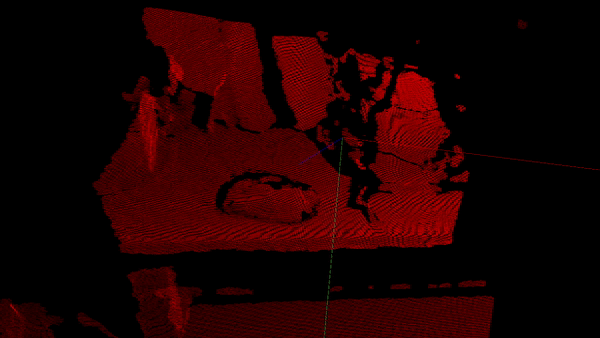
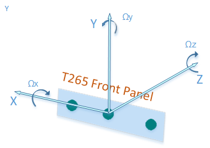

# My App practice

The setup:


Trying to make a 3d scanner for now. Some basic results



# Requirements

* Python enviornment, pyenv: [instructions](https://github.com/yosoufe/instructions/blob/main/python/pyenv.md)
* Install realsense: follow the realsense guidelines. I have documented how I compiled it in [here](https://github.com/yosoufe/instructions/blob/main/realsense/realsense.md.)
* Install Pangolin: [instructions](https://github.com/yosoufe/instructions/blob/main/pangolin.md)
* opencv for calibratiom: [instructions](https://github.com/yosoufe/instructions/blob/main/opencv.md)

#### Other stuff
```bash
python3 -m pip install -U numpy --no-cache-dir --no-binary numpy
python -m pip install transformations\
    wheel \
    matplotlib\
    PyOpenGL
```

## About the sensors

### D435i
According to [realsense github wiki page](https://github.com/IntelRealSense/librealsense/wiki/Projection-in-RealSense-SDK-2.0#point-coordinates) the **D435i** output is as follow:

> Point Coordinates: Each stream of images provided by this SDK is also associated with a separate 3D coordinate space, specified in meters, with the coordinate [0,0,0] referring to the center of the physical imager. Within this space, the positive x-axis points to the right, the positive y-axis points down, and the positive z-axis points forward. Coordinates within this space are referred to as "points", and are used to describe locations within 3D space that might be visible within a particular image.


### T265
According to [this intel blog](https://www.intelrealsense.com/how-to-getting-imu-data-from-d435i-and-t265/) the **T265** output is as follow:

> To aid AR/VR integration, the TM265 tracking device uses the defacto VR framework standard coordinate system instead of the SDK standard:



> 1. Positive X direction is towards right imager
> 2. Positive Y direction is upwards toward the top of the device
> 3. Positive Z direction is inwards toward the back of the device

> The center of tracking corresponds to the center location between the right and left monochrome imagers on the device.


## Increase performance on jetson
```bash
sudo iwconfig wlan0 power off # turn of the wifi's power management
sudo jetson_clocks # max up the clock speed
sudo sh -c 'echo 255 > /sys/devices/pwm-fan/target_pwm' # turn on the fan
```

## VNC on Jetson
- https://medium.com/@bharathsudharsan023/jetson-nano-remote-vnc-access-d1e71c82492b
- https://developer.nvidia.com/embedded/learn/tutorials/vnc-setup