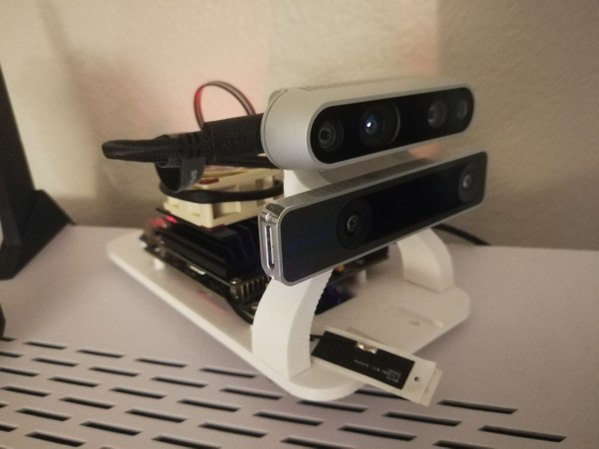

# Requirements

The setup:



Trying to make a 3d scanner for now. Some basic results


## Python env
Install pyenv: https://github.com/pyenv/pyenv
then

```bash
env PYTHON_CONFIGURE_OPTS="--enable-shared --enable-optimizations --enable-ipv6 --with-lto" pyenv install 3.8.5
```

## Install realsense
follow the realsense guidelines. I have documented how I compiled it in `hardware/realsense.md`.

### About the sensors

#### D435i
According to [realsense github wiki page](https://github.com/IntelRealSense/librealsense/wiki/Projection-in-RealSense-SDK-2.0#point-coordinates) the **D435i** output is as follow:

> Point Coordinates: Each stream of images provided by this SDK is also associated with a separate 3D coordinate space, specified in meters, with the coordinate [0,0,0] referring to the center of the physical imager. Within this space, the positive x-axis points to the right, the positive y-axis points down, and the positive z-axis points forward. Coordinates within this space are referred to as "points", and are used to describe locations within 3D space that might be visible within a particular image.


#### T265
According to [this intel blog](https://www.intelrealsense.com/how-to-getting-imu-data-from-d435i-and-t265/) the **T265** output is as follow:

> To aid AR/VR integration, the TM265 tracking device uses the defacto VR framework standard coordinate system instead of the SDK standard:


> 1. Positive X direction is towards right imager
> 2. Positive Y direction is upwards toward the top of the device
> 3. Positive Z direction is inwards toward the back of the device

> The center of tracking corresponds to the center location between the right and left monochrome imagers on the device.

## install Pangolin

https://github.com/stevenlovegrove/Pangolin#required-dependencies

```bash
sudo apt install libgl1-mesa-dev \
    libglew-dev \
    cmake \
    libpython3.8-dev \
    ffmpeg libavcodec-dev libavutil-dev libavformat-dev libswscale-dev libavdevice-dev \
    libdc1394-22-dev libraw1394-dev \
    libjpeg-dev libpng++-dev libtiff5-dev libopenexr-dev

git clone https://github.com/stevenlovegrove/Pangolin.git
cd Pangolin
git submodule init && git submodule update
mkdir build && cd build-
cmake -DCMAKE_BUILD_TYPE=Debug .. -DPYTHON_EXECUTABLE=$(python3 -c "import sys; print(sys.executable)") -DCMAKE_INSTALL_PREFIX=install
make -j`nproc` install

echo -e "\n\nexport PYTHONPATH=\$PYTHONPATH:`realpath src`" >> ~/.bashrc

# for jetson you would need the following as well
export LD_PRELOAD=/usr/lib/aarch64-linux-gnu/libgomp.so.1
# or 
echo -e "\nexport LD_PRELOAD=/usr/lib/aarch64-linux-gnu/libgomp.so.1" >> ~/.bashrc
source ~/.bashrc
```

## Other stuff
```bash
# --no-binary numpy for jetson not x86
python3 -m pip install -U numpy --no-cache-dir --no-binary numpy
python -m pip install transformations\
    wheel \
    matplotlib\
    PyOpenGL
```

# Increase performance on jetson
```bash
sudo iwconfig wlan0 power off # turn of the wifi's power management
sudo jetson_clocks # max up the clock speed
sudo sh -c 'echo 255 > /sys/devices/pwm-fan/target_pwm' # turn on the fan
```

## VNC on Jetson
- https://medium.com/@bharathsudharsan023/jetson-nano-remote-vnc-access-d1e71c82492b
- https://developer.nvidia.com/embedded/learn/tutorials/vnc-setup